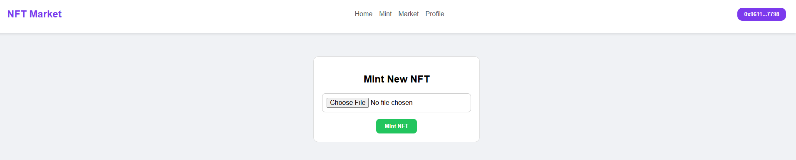
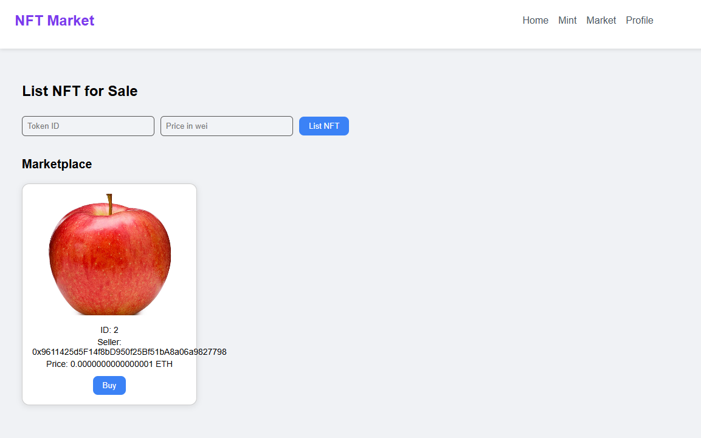
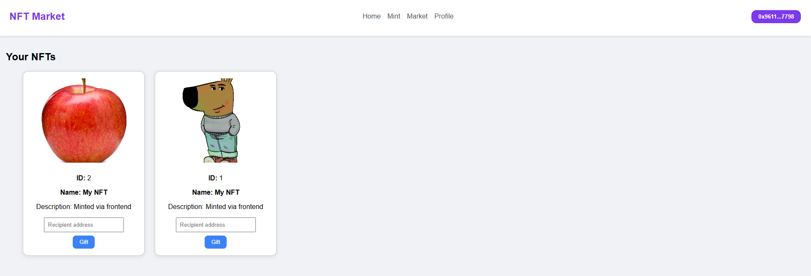

# NFT Marketplace — Документация


## 📌 Описание

Этот проект представляет собой децентрализованный маркетплейс NFT, где пользователи могут просматривать выставленные на продажу NFT и покупать их напрямую через смарт-контракт.

## 🔧 Стек технологий

- Frontend: React, ethers.js
- Backend (блокчейн): смарт-контракты на Solidity (ERC-721 + маркетплейс)
- Сеть: Sepolia Testnet
- Дополнительно: Web3 Provider (MetaMask), Pinata для хранения NFT

## 📁 Структура проекта

### Frontend
Всего 3 основные страницы:

### Mint


### Market


### Profile


## 🛠 Развертывание

1. Деплой контрактов:  
Можно использовать контракты уже указанные в frontend/src/services/contract.js либо развернуть новые:  
    1.1) создай .env в /nft:
    ```
    PRIVATE_KEY= "YOUR_PRIVATE_KEY" 

    SEPOLIA_RPC_URL="YOUR_RPC_URL"
    ```
    1.2)
    ```
    cd nft
    npm install --save-dev hardhat @nomicfoundation/hardhat-toolbox ethers dotenv @openzeppelin/contracts
    npx hardhat compile
    npx hardhat run scripts/deploy.js --network sepolia
    ```
    В frontend/src/services/contract.js нужно вручную изменить адреса контрактов (адреса новых контрактов указаны в логах).

2. Установи зависимости для фронта и запусти сервер:
    ```
    npm install

    npm start
    ```


## Pinata

Для хранения NFT используется Pinata. 
Метаданные NFT сохраняются в виде json:

```json
{
  "name": "CryptoCat #7",
  "description": "A rare crypto kitty",
  "image": "https://ipfs.io/ipfs/QmHash/image.png"
}
```

## 📘 Функции контракта `NFTContract`

### `mintNFT(string uri): (uint256)`

Минтит (выпускает) новый NFT и присваивает ему URI.

- **Параметры:**
  - `uri` — строка, указывающая на метаданные токена (ipfs ссылка).

- **Возвращает:**
  - `newTokenId` — ID нового токена.

---

### 🔍 `tokenURI(uint256 tokenId): string`

Возвращает URI метаданных конкретного токена.

- **Параметры:**
  - `tokenId` — ID токена.

- **Возвращает:**
  - Строку с URI, привязанную к токену.

- **Проверки:**
  - Токен должен существовать (иначе выбрасывается исключение).


## 📘 Функции контракта `NFTMarket`

В конструктор контракта передаются следующие параметры:
  - `address _nftContract` — адрес NFT-контракта.

---

### 📝 `listNFTForSale(uint256 tokenId, uint256 price)`

Выставляет NFT на продажу.

- **Параметры:**
  - `tokenId` — ID токена.
  - `price` — цена в wei.

- **Проверки:**
  - Отправитель должен быть владельцем токена.
  - Цена должна быть больше нуля.

---

### 💰 `buyNFT(uint256 tokenId)`

Покупает выставленный NFT.

- **Действия:**
  - Проверяет, что NFT находится в активном листинге.
  - Проверяет соответствие присланной суммы указанной цене.
  - Переводит ETH продавцу.
  - Передаёт NFT покупателю.

---

### 🎁 `giftNFT(uint256 tokenId, address recipient)`

Дарит NFT указанному получателю.

- **Параметры:**
  - `tokenId` — ID токена.
  - `recipient` — адрес получателя.

- **Проверки и действия:**
  - Получатель не должен быть нулевым адресом.
  - Отправитель должен владеть NFT.
  - Нельзя подарить себе.
  - Если NFT был в листинге — он снимается.
  - NFT передаётся получателю.

---

